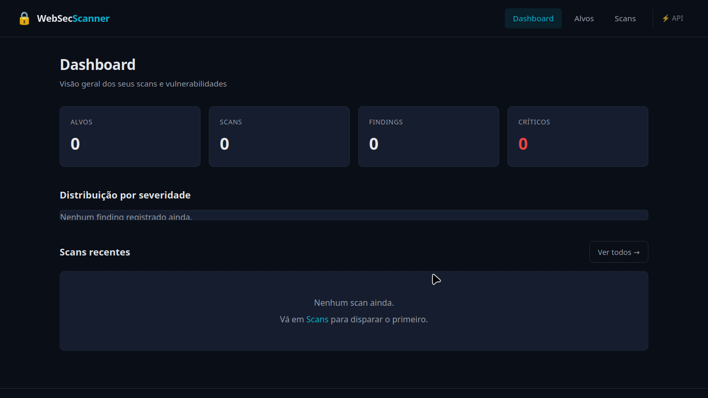
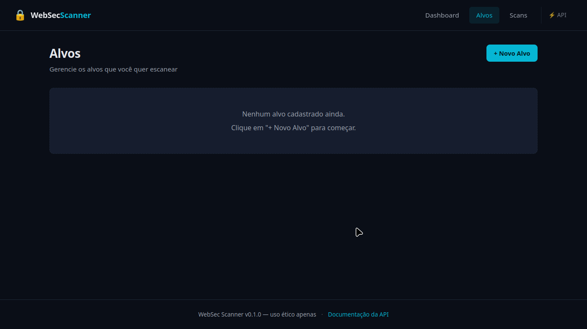
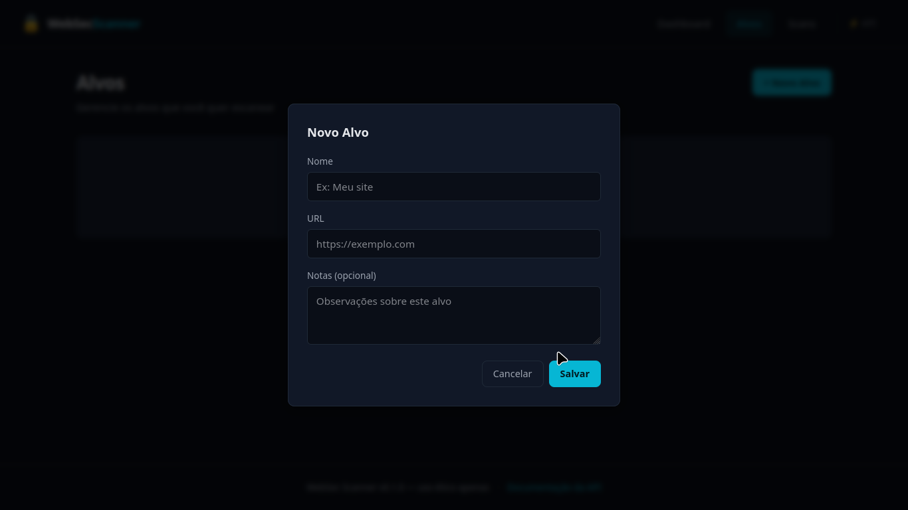
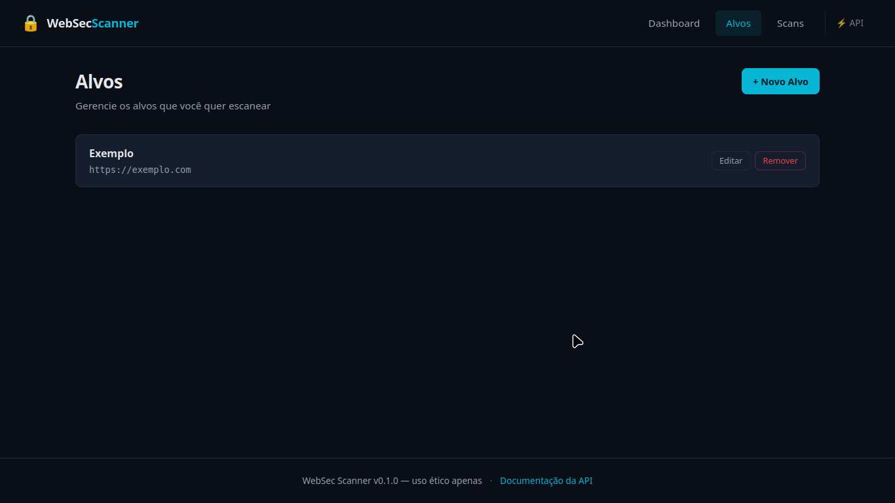
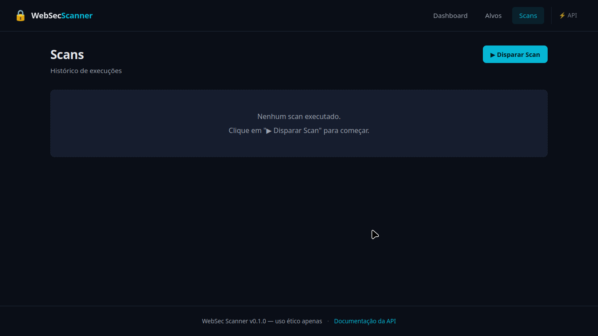
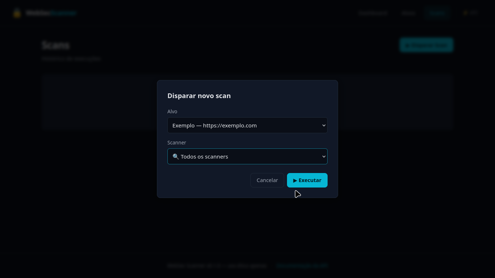
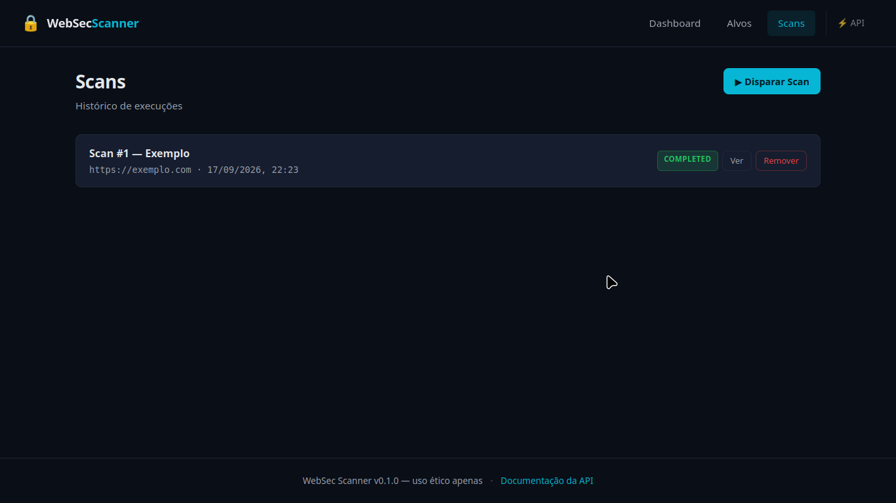
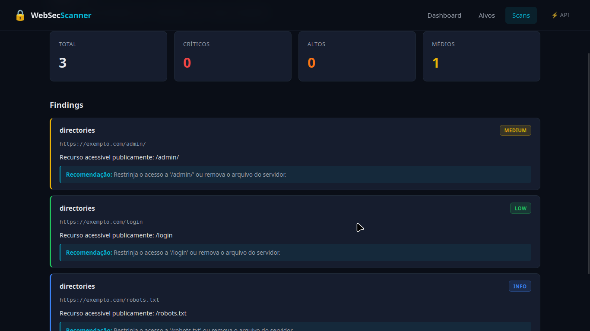

# 🔒 WebSec Scanner

Ferramenta de análise de vulnerabilidades web com **dashboard visual** e **API REST documentada**. Detecta problemas comuns de segurança em aplicações HTTP.



> ⚠️ **Uso ético apenas.** Esta ferramenta deve ser usada exclusivamente em alvos que você possui ou tem autorização explícita para testar. Uso não autorizado é crime (Lei 12.737/2012 no Brasil).

---

## ✨ Funcionalidades

- **Scanner de headers de segurança** — detecta `Content-Security-Policy`, `HSTS`, `X-Frame-Options` e outros headers ausentes
- **Análise de informações do servidor** — identifica tecnologias e versões expostas via headers HTTP
- **Descoberta de diretórios sensíveis** — procura por `/admin`, `/.env`, `/backup.zip`, `/phpinfo.php` e outros paths críticos, com **baseline check** para evitar falsos positivos
- **Dashboard web** — interface dark mode com visualização de alvos, scans e findings
- **API REST** — todos os recursos acessíveis via HTTP, com documentação interativa automática
- **Scan em background** — não bloqueia a interface, progresso acompanhado por polling automático
- **Execução paralela** — requisições concorrentes para scans rápidos mesmo em alvos lentos

---

## 🛠 Stack

| Camada | Tecnologia |
|---|---|
| Motor do scanner | Python 3.12 + `requests` + `BeautifulSoup` |
| API | FastAPI + Uvicorn |
| Banco | SQLite + SQLAlchemy 2.0 |
| Front-end | HTML + CSS + JavaScript puro |
| Templates | Jinja2 |
| CLI | `argparse` + `rich` |

---

## 🏗 Arquitetura

```
┌─────────────────────────────────────────┐
│  Dashboard (HTML/CSS/JS)                │
└─────────────────┬───────────────────────┘
                  │ fetch()
┌─────────────────▼───────────────────────┐
│  API REST (FastAPI)                     │
│  /api/targets   /api/scans  /api/findings│
└─────────────────┬───────────────────────┘
                  │
      ┌───────────┼─────────────┐
      │           │             │
┌─────▼─────┐ ┌───▼────┐ ┌──────▼──────┐
│  SQLite   │ │ Motor  │ │  Reporters  │
│  (dados)  │ │ websec │ │  (console,  │
│           │ │        │ │  html, json)│
└───────────┘ └────────┘ └─────────────┘
```

O motor (`websec/`) é **independente da API**. Ele pode ser usado via CLI (`python -m websec --url ...`) ou consumido pela aplicação web (`web/`). Essa separação permite evoluir os dois lados sem quebrar nada.

### Estrutura de pastas

```
websec-scanner/
├── websec/              # Motor do scanner (CLI)
│   ├── core/            # Sessão HTTP, orquestração
│   ├── models/          # Finding, Target, Severity
│   ├── scanners/        # Scanners individuais
│   ├── reporter/        # Saídas (console, html, json)
│   └── cli.py           # Interface de linha de comando
│
├── web/                 # Aplicação web
│   ├── routes/          # Endpoints da API REST
│   ├── services/        # Lógica de negócio
│   ├── templates/       # Templates Jinja2
│   ├── static/          # CSS e JavaScript
│   ├── models.py        # Modelos SQLAlchemy
│   └── app.py           # Aplicação FastAPI
│
├── docs/
│   └── screenshots/     # Imagens para o README
│
├── run.py               # Entrypoint da aplicação web
└── requirements.txt
```

---

## 🚀 Como rodar

### Pré-requisitos

- Python 3.12+
- pip
- Git

### Instalação

```bash
# Clone o repositório
git clone https://github.com/zGusTTaa/websec-scanner.git
cd websec-scanner

# Crie o ambiente virtual
python3 -m venv .venv
source .venv/bin/activate        # Linux/macOS
# .\.venv\Scripts\Activate.ps1   # Windows PowerShell

# Instale as dependências
pip install -r requirements.txt

# Copie o template de variáveis de ambiente
cp .env.example .env
```

### Uso via CLI

```bash
python -m websec --url https://example.com
```

Saída: tabela colorida com severidade e descrição de cada vulnerabilidade encontrada.

### Uso via dashboard

```bash
python run.py
```

Depois abra:

- **http://localhost:8000** — dashboard visual
- **http://localhost:8000/docs** — documentação interativa da API (Swagger)

---

## 📸 Screenshots

### 🖥️ Dashboard

Visão geral com contadores de alvos, scans e findings, além da distribuição por severidade.


### 🎯 Gerenciamento de Alvos

CRUD completo de alvos que serão escaneados.

| Lista vazia | Novo Alvo |
|---|---|
|  |  |

Após cadastrar:



### 🔍 Scans

Disparo de scan com seleção de alvo e scanner:

| Lista vazia | Disparar Scan |
|---|---|
|  |  |

Status atualizado em tempo real após a execução:



### 📋 Detalhes do Scan

Findings agrupados por severidade, com descrição e recomendação de correção.



---

## 📡 Endpoints da API

| Método | Endpoint | Descrição |
|---|---|---|
| GET | `/api/targets/` | Lista alvos cadastrados |
| POST | `/api/targets/` | Cadastra novo alvo |
| GET | `/api/targets/{id}` | Busca alvo por ID |
| PUT | `/api/targets/{id}` | Atualiza alvo |
| DELETE | `/api/targets/{id}` | Remove alvo |
| GET | `/api/scans/` | Lista scans (filtro: `target_id`) |
| POST | `/api/scans/` | Dispara scan em background |
| GET | `/api/scans/{id}` | Detalhes do scan + findings |
| DELETE | `/api/scans/{id}` | Remove scan |
| GET | `/api/findings/` | Lista findings (filtros: `scan_id`, `severity`) |
| GET | `/api/findings/{id}` | Busca finding por ID |
| DELETE | `/api/findings/{id}` | Remove finding |

Documentação interativa completa em `/docs`.

---

## 🧪 Exemplo de uso

1. Acesse o dashboard em `http://localhost:8000`
2. Vá em **Alvos** → **+ Novo Alvo** → cadastre `https://example.com`
3. Vá em **Scans** → **▶ Disparar Scan** → escolha o alvo e o scanner
4. Acompanhe o progresso em tempo real (badge muda de `RUNNING` para `COMPLETED`)
5. Clique em **Ver** para inspecionar os findings com severidade colorida

---

## 🧠 Decisões técnicas

- **Baseline check no scanner de diretórios** — antes de classificar um path como exposto, o scanner faz uma requisição a um path aleatório para detectar servidores que respondem `200 OK` para qualquer coisa (falsos positivos comuns).
- **Execução paralela com `ThreadPoolExecutor`** — o scanner de diretórios testa 20+ paths simultaneamente, reduzindo o tempo total de ~100s para ~10s.
- **Background tasks + polling** — scans rodam em background no FastAPI, e o front-end acompanha o status por polling. Evita travar a interface em operações longas.
- **Separação motor/aplicação** — o motor `websec/` não conhece FastAPI, SQLAlchemy ou o dashboard. Ele é uma biblioteca Python pura que pode ser consumida por qualquer interface.

---

## 🗺 Roadmap

- [x] Motor de scanner modular (headers, server_info, directories)
- [x] API REST com CRUD completo
- [x] Dashboard web com dark mode
- [x] Scan em background com polling automático
- [x] Execução paralela no scanner de diretórios
- [x] Baseline check para eliminar falsos positivos
- [ ] Scanner de SQL Injection
- [ ] Scanner de XSS refletido
- [ ] Exportação de relatórios em HTML/PDF
- [ ] Docker + docker-compose
- [ ] Testes automatizados (pytest)
- [ ] Autenticação de usuários

---

## 🤝 Contribuindo

Contribuições são bem-vindas. Abra uma issue para discutir mudanças antes de enviar um PR.

---

## 📄 Licença

Este projeto está sob a licença MIT — veja o arquivo `LICENSE` para detalhes.

---

## 👤 Autor

**Gustavo** — [@zGusTTaa](https://github.com/zGusTTaa)

Estudante de Análise e Desenvolvimento de Sistemas, com foco em **cyber segurança** e **desenvolvimento back-end**.

---

⭐ Se este projeto foi útil, considere dar uma estrela no repositório.